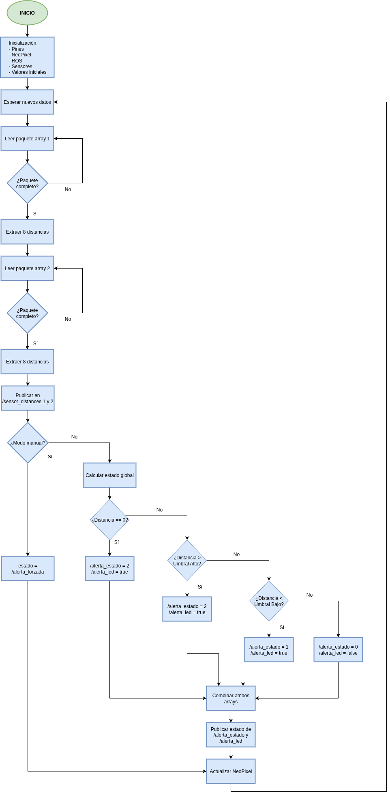

# iLYDAR : información por LEDs y Detección Anular de Rango
Este proyecto forma parte del Trabajo Fin de Grado de Ingeniería Electrónica Industrial.  
Consiste en la integración de dos arrays de sensores de distancia TeraRanger Multiflex con un Arduino Mega 2560, una tira de LEDs NeoPixel y ROS (Robot Operating System).  
El sistema detecta si los sensores están dentro de un rango válido, calcula un estado global de alerta (0/1/2) y muestra el resultado en los LEDs, además de publicarlo en ROS.

## Requisitos
- Ubuntu 20.04 con ROS Noetic instalado
- Arduino Mega 2560 (ATmega2560)
- Sensor TeraRanger Multiflex
- Tira de LEDs NeoPixel (Adafruit)
- Librerías y herramientas:
  - `rosserial_arduino`, `rosserial_python`, `std_msgs`
  - PlatformIO para compilar y cargar el código al Arduino
  - Adafruit NeoPixel (`lib_deps` en `platformio.ini`)

## Conexiones de hardware

### Arduino Mega 2560 (ATmega2560)

- Sensor TeraRanger Multiflex:
  - RX (sensor1) → TX 1 (D18) del Arduino (no es necesario)
  - TX (sensor1) → RX1 (D19) del Arduino
  - RX (sensor2) → TX2 (D16) del Arduino (no es necesario)
  - TX  (sensor2) → RX2 (D17) del Arduino
  - Alimentación: 5V y GND desde el Arduino o fuente externa

- Tira de LEDs NeoPixel:
  - Din → pin 6 (Arduino)
  - 5V → 5V Arduino (se recomienda usar fuente externa si se alimentan más de 2 LEDs)
  - GND → GND Arduino

## Diagrama de flujo del programa



El programa comienza con la inicialización de los componentes principales: pines, tira de LEDs (NeoPixel), rosserial y comunicación con el array de sensores.  
Una vez iniciado, el Arduino entra en un bucle en el que:

1. Espera a recibir un paquete completo de datos desde los sensores.
2. Cuando los dos paquetes están completos, publica las distancias en los topics `/sensor_distances_1` y `/sensor_distances_2`.
3. Se comprueba si el modo manual está activo.
   - Si lo está, deja de funcionar de forma automática para obedecer a `/alerta_forzada`.
   - Si no lo está, funciona de forma automática.
4. Se evalúa si las distancias están dentro de un rango válido de forma que:
   - distancia == 0 → se interpreta como vacío, es decir, ALTO → `/alerta_estado` = 2 y `/alerta_led` = true
   - distancia > UMBRAL_ALTO → ALTO → `/alerta_estado` = 2 y `/alerta_led` = true
   - distancia < UMBRAL_BAJO → BAJO → `/alerta_estado` = 1 y `/alerta_led` = true
   - Resto → OK → `/alerta_estado` = 0 y `/alerta_led` = false
5. Se publican los topics `/alerta_estado` y `/alerta_led` solo si cambian de estado.
6. Se cambia el color de los LEDs según el estado y su modo de funcionamiento:
  - Modo manual:
    - Si `/alerta_forzada` = `true` → alerta → LEDs en rojo.
    - Si `/alerta_forzada` = `false` → todo correcto → LEDs en verde.
  - Modo automático:
    - Si `/alerta_estado` = 2 → alerta → LEDs en rojo.
    - Si `/alerta_estado` = 1 → alerta → LEDs en azul.
    - Si `/alerta_estado` = 0 → todo correcto → LEDs en verde.
8. El ciclo se repite continuamente.

## Como ejecutar el sistema
1) ROS (en 2 terminales distintos)
```bash
roscore
rosrun rosserial_python serial_node.py _port:=/dev/ttyUSB0 
```
2) Comandos útiles:

  **Modo manual ON:**
```bash
rostopic pub /modo_manual std_msgs/Bool "data: true" -1
```
   **Forzar alerta a true:** 
```bash
rostopic pub /alerta_forzada std_msgs/Bool "data: true" -1
```
   **Forzar alerta a false:**
```bash
rostopic pub /alerta_forzada std_msgs/Bool "data: false" -1
```
   **Volver a modo automático:**
```bash
rostopic pub /modo_manual std_msgs/Bool "data: false" -1
```

## Pruebas realizadas
Se han realizado las siguientes pruebas (más información en docs/pruebas.md):
- Publicación continua de distancias desde ambos arrays de sensores.
- Cálculo del estado global en Arduino con prioridad ALTO > BAJO > OK.
- Evaluación del modo manual.
- Tolerancia a pérdida de datos de un array.

