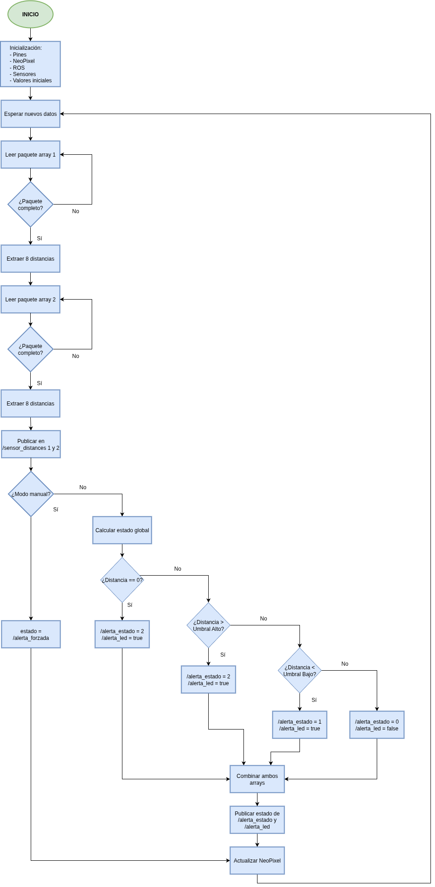

# TFG: TeraRanger Multiflex + Arduino + ROS (Nodo C++)
Este proyecto forma parte del Trabajo Fin de Grado de Ingeniería Electrónica Industrial.  
Consiste en la integración de sensores de distancia TeraRanger Multiflex con un Arduino Mega 2560, una tira de LEDs NeoPixel y ROS (Robot Operating System).  
El sistema detecta si los sensores están dentro de un rango válido y muestra una alerta visual a través de los LEDs.

## Requisitos
- Ubuntu 20.04 con ROS Noetic instalado
- Arduino Nano (ATmega328P, bootloader nuevo)
- Sensor TeraRanger Multiflex
- Tira de LEDs NeoPixel (Adafruit)
- Librerías y herramientas:
  - `rosserial_arduino`, `rosserial_python`, `std_msgs`
  - PlatformIO para compilar y cargar el código al Arduino
  - Adafruit NeoPixel (`lib_deps` en `platformio.ini`)

## Conexiones de hardware

### Arduino Nano (ATmega328P - bootloader nuevo)

- Sensor TeraRanger Multiflex:
  - RX (sensor) → pin 8 (Arduino)
  - TX (sensor) → pin 9 (Arduino) (no es necesario)
  - Alimentación: 5V y GND desde el Arduino o fuente externa

- Tira de LEDs NeoPixel:
  - Din → pin 6 (Arduino)
  - 5V → 5V Arduino (se recomienda usar fuente externa si se alimentan más de 2 LEDs)
  - GND → GND Arduino

### Notas

- Los pines 8 y 9 se usan con `SoftwareSerial` para la comunicación con el sensor.
- El pin 6 se usa con la librería `Adafruit NeoPixel`.
- El sensor y los LEDs pueden compartir alimentación si el consumo lo permite.

## Diagrama de flujo del programa



El programa comienza con la inicialización de los componentes principales: pines, tira de LEDs (NeoPixel), rosserial y comunicación con el sensor (SoftwareSerial).  
Una vez iniciado, el Arduino entra en un bucle en el que:

1. Espera a recibir un paquete completo de datos desde el sensor.
2. Cuando el paquete está completo, publica las distancias en el topic `/sensor_distances`.
3. El nodo ROS evalúa si las distancias están dentro de un rango válido y publica un valor booleano en `/alerta_led`.
4. El Arduino recibe este valor y cambia el color de los LEDs:
   - Si `true` → alerta → LEDs en rojo.
   - Si `false` → todo correcto → LEDs en verde.
5. El ciclo se repite continuamente.

Este diagrama refleja la interacción entre el Arduino y ROS de forma cíclica y sin fin mientras el sistema esté en funcionamiento.

## Como ejecutar el sistema
1) Arduino
```bash
cd arduino
pio run -t upload
```
3) ROS (en 3 terminales distintos)
```bash
roscore
rosrun rosserial_python serial_node.py _port:=/dev/ttyUSB0 _baud:=57600 
rosrun sensor_alerta alerta_automatica
```
4) Comandos útiles:

  **Modo manual ON:**
```bash
rostopic pub /modo_manual std_msgs/Bool "data: true" -1
```
   **Forzar alerta a true:** 
```bash
rostopic pub /alerta_forzada std_msgs/Bool "data: true" -1
```
   **Forzar alerta a false:**
```bash
rostopic pub /alerta_forzada std_msgs/Bool "data: false" -1
```
   **Volver a modo automático:**
```bash
rostopic pub /modo_manual std_msgs/Bool "data: false" -1
```

## Pruebas realizadas
Se han realizado las siguientes pruebas (más información en docs/pruebas.md):
- Publicación de distancias desde Arduino
- Generación de alerta desde el nodo ROS
- Encendido correcto de los LEDs

